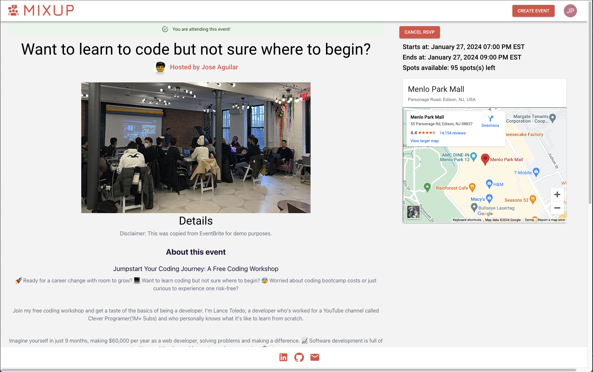

# Mixup

Mixup is my capstone project for the Flatiron School Software Engineering program. It is an event creation and management app inspired by Eventbrite and Meetup.com.

As a user, you can:
- Create a user profile upon signup
- Create events, with info including date/time, a place (thanks to Google Places API), and a description of the event itself.
- Modify event details, or cancel events
- RSVP to other events

## Demo
[https://youtu.be/vS58MYMs2YE?si=jHvF8R0trdiFZhoD](https://youtu.be/vS58MYMs2YE?si=jHvF8R0trdiFZhoD)

## Technologies

- [React](https://react.dev/)
- [React Router v6](https://reactrouter.com/en/main)
- [Ruby on Rails](https://rubyonrails.org/)
- [Material UI](https://mui.com/)
- [Google Places API](https://developers.google.com/maps/documentation/places/web-service/overview)
- [Google Maps Embed API](https://developers.google.com/maps/documentation/embed/get-started)
- [TinyMCE](https://www.tiny.cloud/)
- [Render](https://render.com/)

## Getting Started

Visit https://mixup.onrender.com/ and sign up for an account. Upon signup you will be asked to create a user profile.

## Usage

### Creating an event
- Click on **Create Event** at the top right corner.
- Fill out all fields including the location and the details about the event itself.
- Include an event picture, this will be on the event card displayed on the front page.
  
### RSVPing to an event
- Click on an event card on the front page and click on **RSVP** on the top left.

---
## Future Improvements
### Features

- [x] Implement sign up with email/email confirmation
- [x] Implement password reset
- [ ] Apply password complexity requirements
- [ ] Implement ability to sort events by distance to current location
- [x] Display avatar with user profile picture
